# Four Parks Colombia
Four Parks Colombia is an advanced national parking reservation system. This system is designed to facilitate the search and reservation of parking spaces quickly and easily. In addition, it has a complete management and administration module, which allows administrators to efficiently manage all aspects related to parking, including availability, rates, and access control. With its intuitive interface and robust functionalities, Four Parks Colombia is positioned as the ideal solution to optimize the parking experience for both users and administrators.

# Features
## General
### Landing
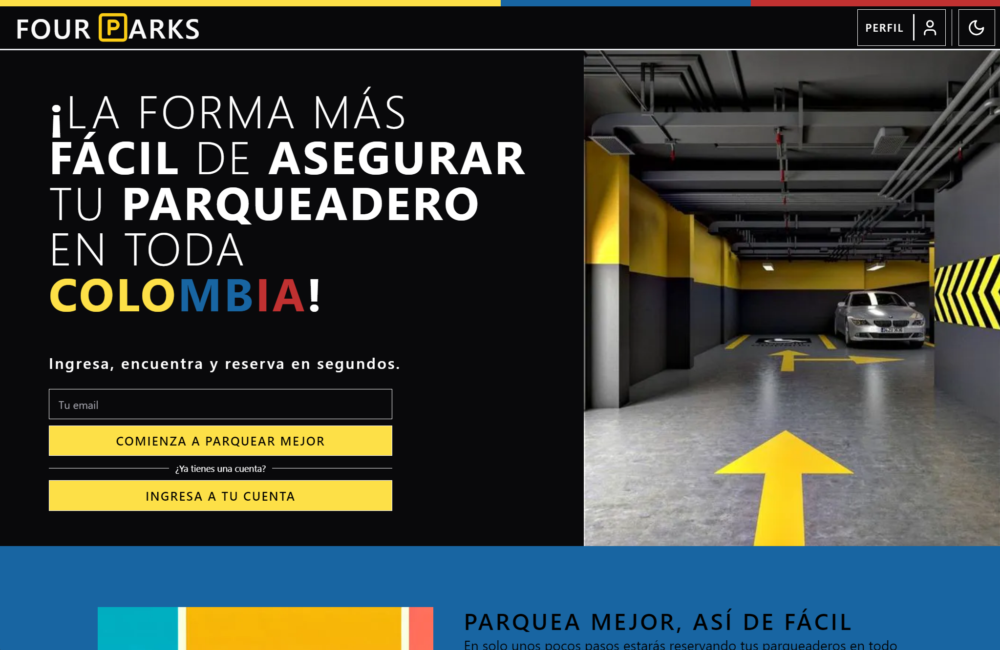
### Responsive
#### Responsive - Landing
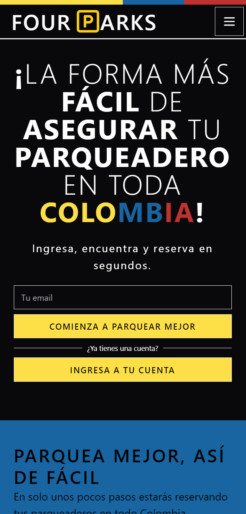
#### Responsive - Login
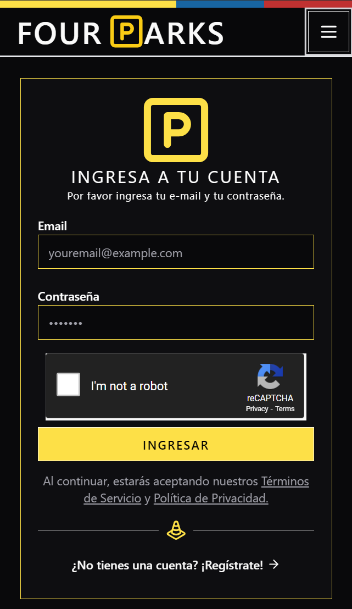
#### Responsive - Select Parkings
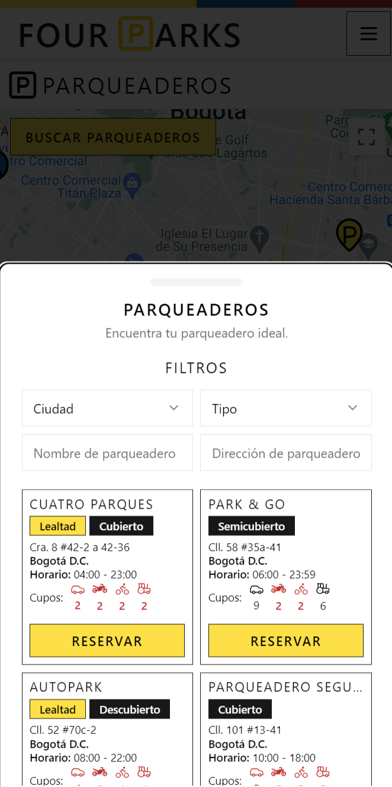

### Theme
#### Dark Theme - Login
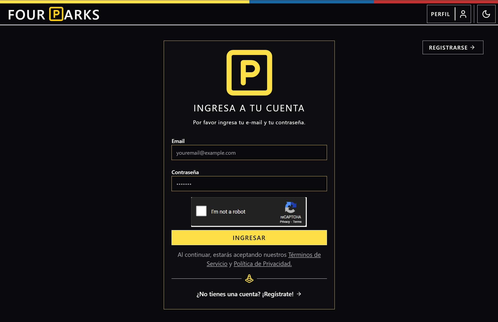
#### Light Theme - Login
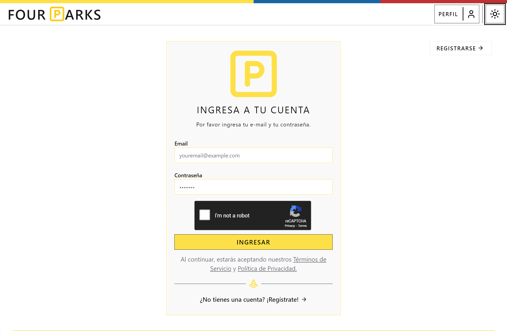

### Users
### Select Parkings
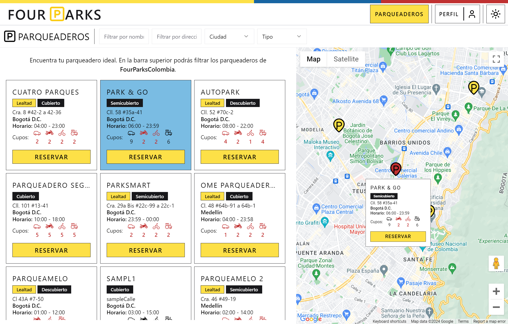
### Reservation
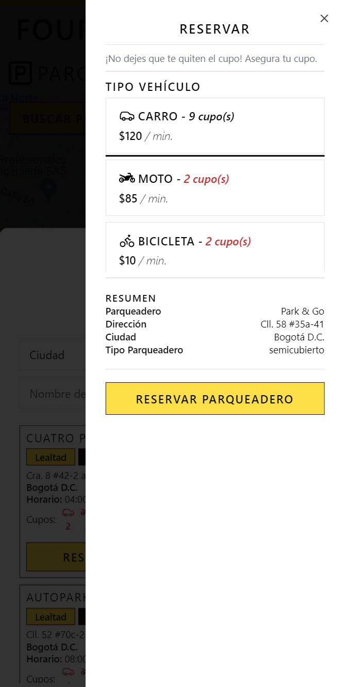
### Profile
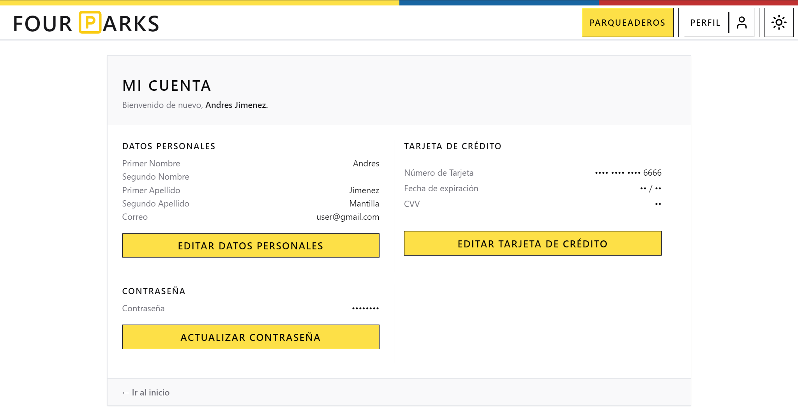
### Reservation History
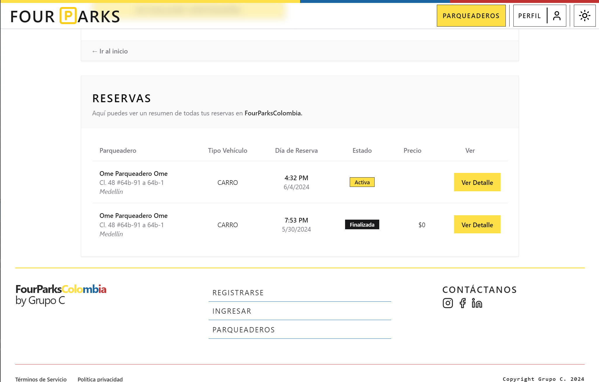
### Reservation Resume
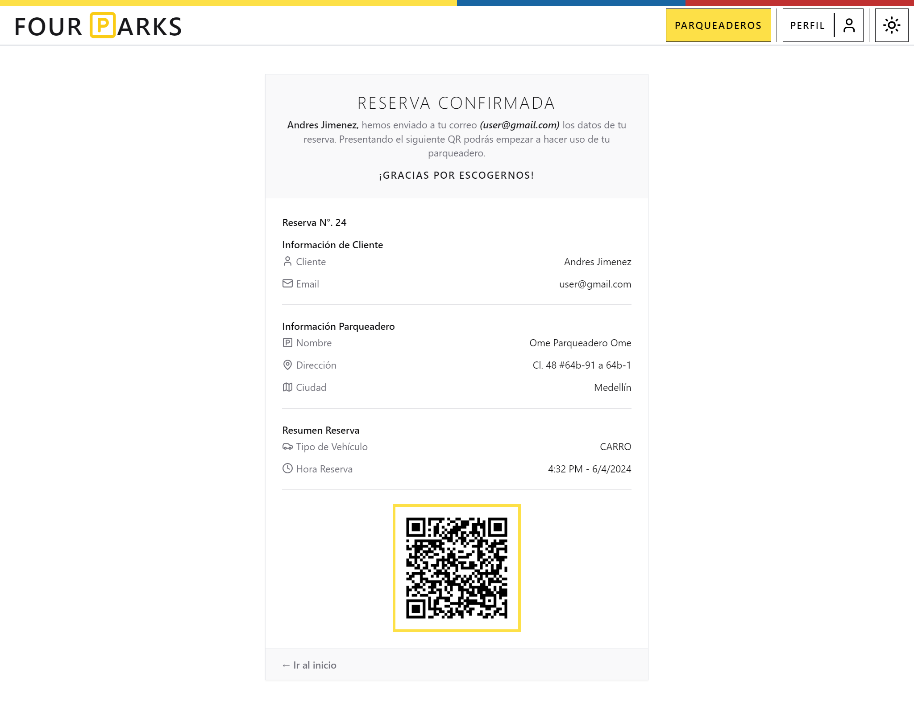

## Manager
### Manager Menu
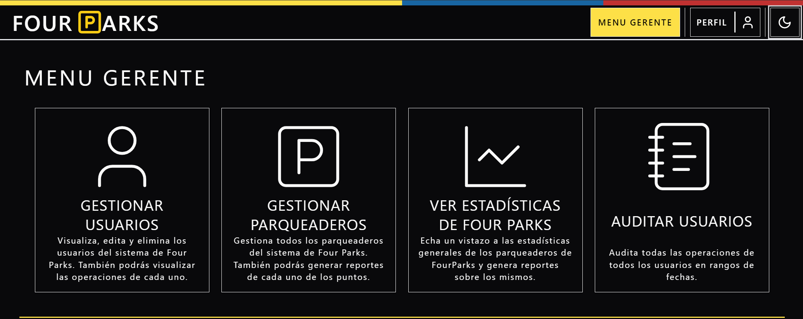
### Manage Users

#### Create Users
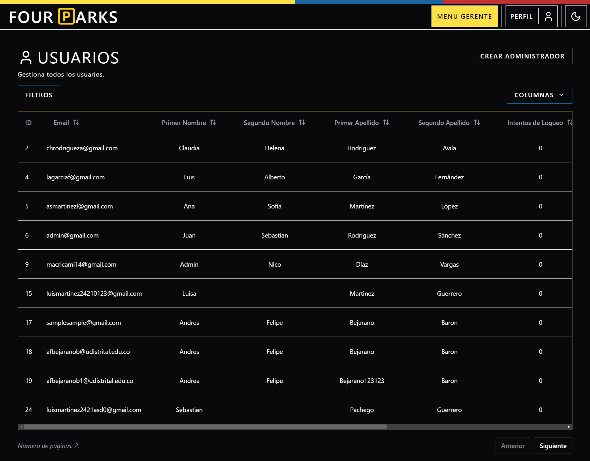

### Manage Parkings
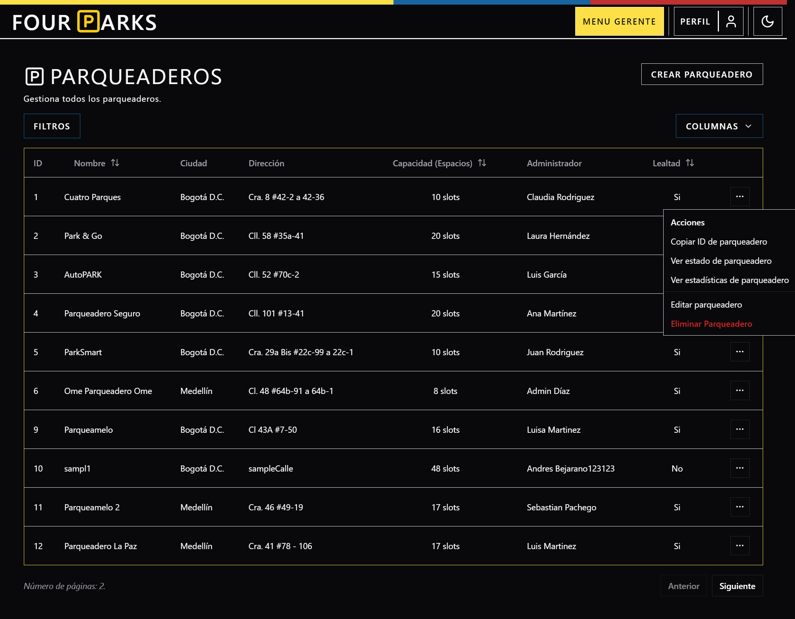
### Stats
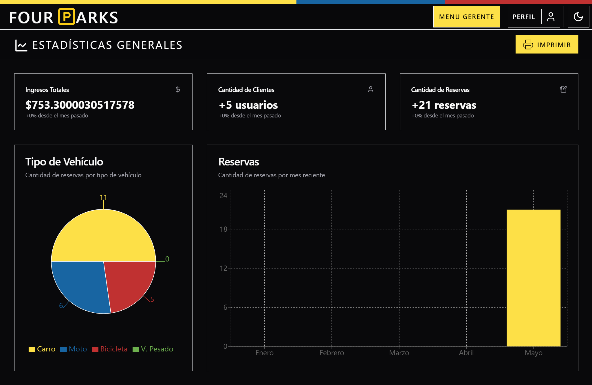

